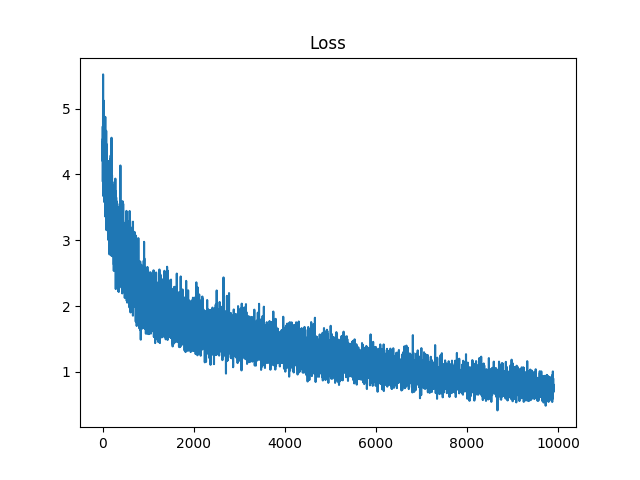
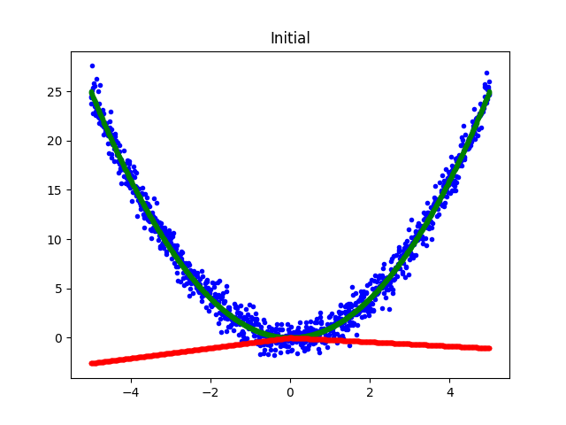
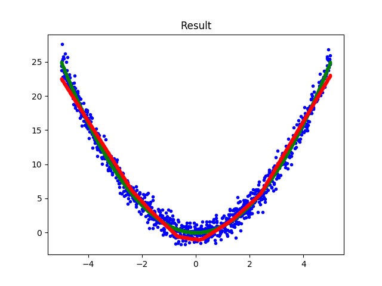
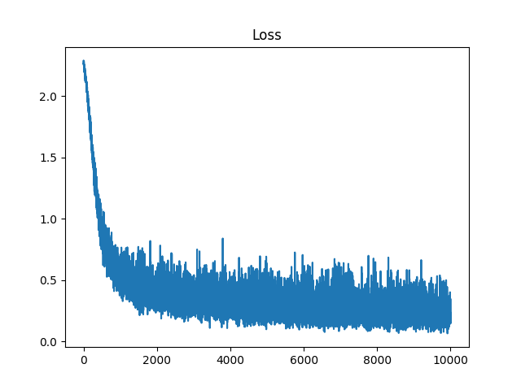
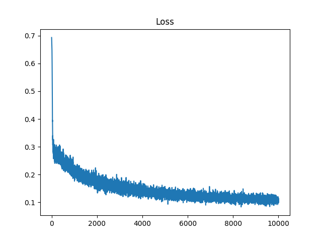
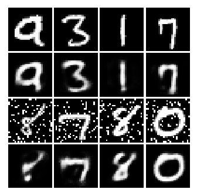

# Neural-Network-Numpy
Numpy implementation of fully connected neural network.

## Requirement
- python 3.6
- numpy
- matplotlib

## Useage
### Regression
```
python 01_Numpy_NN_Regression.py
```




### Classification
```
python 02_Numpy_NN_Classification.py
```



### Autoencoder
```
python 03_Numpy_NN_autoencoder.py
```

